# Relay

**Reliability infrastructure for AI agents.**

Relay records every model call, tool invocation, and retrieval an AI agent
performs; replays them deterministically against modified code; evaluates
them against contracts declared in CEL; and produces signed,
content-addressed evidence bundles that prove how the system behaved.

Apache 2.0. Python, TypeScript, and a `rly` command-line interface.

[](https://pypi.org/project/epochly-relay/)
[](https://www.npmjs.com/package/@epochly/relay)
[](https://www.npmjs.com/package/@epochly/relay-sidecar-bundle)
[](LICENSE)

---

## The problem Relay solves

Teams shipping AI features in production run into a consistent set of
operational failures:

- Silent regressions in tool calls that previously worked.
- Structured outputs that drift out of schema as models update.
- Retrieval steps that return different documents in production than
  in development.
- Eval score movements after a provider rolls out a new model version,
  with no way to isolate the cause.
- Customer-reported defects that cannot be reproduced from logs alone.

Relay provides the recording, replay, evaluation, and evidence layer
underneath the agent so each of these failures becomes diagnosable
through the same workflow.

## Approach

Relay separates the system into four primitives that share one trace
format and one contract DSL across SDKs:

- **Recorder.** A loopback sidecar captures every model call, tool call,
  and retrieval as a signed envelope, written to a tamper-evident
  append-only log on the local host.
- **Replay engine.** Recorded traces play back deterministically against
  modified application code. The default mode replays a fixed cassette
  of provider responses; live mode is opt-in and is marked in the
  resulting evidence.
- **Contract engine.** Behavioral requirements are declared in CEL and
  evaluated against the recorded trace by the Relay gate engine. The
  language model is never asked whether its own behavior was correct.
- **Evidence bundles.** Every gate decision binds the contracts that
  ran, the assertions they evaluated, the artifact hashes they produced,
  and the manifest commit the agent was built against, into a single
  Sigstore-signed bundle that can be verified offline.

## Architecture

```mermaid
flowchart LR
    subgraph App["Your application"]
        direction TB
        Agent["Agent code"]
        Adapters["Provider adapters<br/>(OpenAI, Anthropic,<br/>Vercel AI, LangChain, MCP)"]
        Agent --> Adapters
    end

    subgraph SDK["Relay SDK (Python / TypeScript)"]
        direction TB
        Wrap["Decorators &amp; context managers<br/>(@model_call, @tool_call, trace)"]
        Envelope["Canonical envelope serializer<br/>(JCS-normalized JSON)"]
        Wrap --> Envelope
    end

    subgraph Sidecar["Local sidecar (per host, lockfile-serialized)"]
        direction TB
        Ingest["Ingest endpoint<br/>(FastAPI, loopback only)"]
        Log["Append-only event log<br/>(aiosqlite, WAL)"]
        Redact["Redaction policy engine<br/>(default-deny on raw capture)"]
        Ingest --> Redact --> Log
    end

    subgraph Engines["Replay &amp; verification"]
        direction TB
        Replay["Replay engine<br/>(cassette-first, sandbox-net=deny)"]
        Contracts["Contract engine<br/>(CEL + Relay UDFs)"]
        Gate["Gate decision aggregator"]
        Replay --> Contracts --> Gate
    end

    subgraph Evidence["Evidence layer"]
        direction TB
        Bundle["Signed evidence bundle<br/>(Sigstore + SLSA L3 provenance)"]
        Verifier["Offline verifier<br/>(rly verify, JWKS trust anchor)"]
        Gate --> Bundle
        Bundle -. consumed by .-> Verifier
    end

    Adapters --> Wrap
    Envelope -->|HTTP loopback| Ingest
    Log --> Replay
```



The SDK wraps your agent's existing calls without modifying the surrounding
code. Envelopes flow over loopback HTTP to a per-host sidecar that
serializes ingest, applies the active redaction policy, and persists to a
WAL-mode SQLite log. The replay engine reads recorded envelopes and
re-executes them against a fixed provider cassette, feeding the resulting
trace to the contract engine. Gate decisions are emitted as Sigstore-signed
evidence bundles with SLSA L3 provenance; the `rly verify` CLI checks them
offline against the published JWKS trust anchor.

## Trust model

The reliability of an AI system depends on where verification occurs.
LLM output is non-deterministic and can misrepresent the system's actual
behavior — emitting tool calls that look plausible without performing
the side effect, returning structured output that almost validates, or
asserting retrieval citations that were never fetched.

Relay places verification outside the language model:

| Layer | Source of truth |
|---|---|
| What occurred | The SDK-captured trace |
| Whether requirements were met | CEL contracts evaluated by the gate engine |
| What a third party can confirm | Signed evidence bundle, verifiable offline |

Agent observability frameworks that derive correctness from the model's
self-report cannot meet this standard. Relay's primitives are designed
so that no decision about correctness flows back through the language
model under evaluation.

## Install

```bash
# Python SDK and `rly` CLI
pip install epochly-relay
# or, with uv:
uv pip install epochly-relay

# TypeScript SDK and sidecar bundle (also installs the `rly` binary)
npm install @epochly/relay
```

Both packages publish via OIDC trusted publishing with SLSA L3 provenance
and Sigstore attestations on every release.

## Quickstart

Wrap agent operations, evaluate a contract, ship a signed bundle:

```python
from epochly_relay import trace, model_call, tool_call, validate_contract

@model_call
def ask(prompt: str) -> str:
    ...

@tool_call(side_effect="read")
def search(query: str) -> list[str]:
    ...

with trace(scope_id="refund-policy-lookup") as run:
    answer = ask("Find the policy for refund requests")
    docs = search(answer)
    result = validate_contract("refund_policy_present", run)
    assert result.ok
```

Operational commands:

```bash
# Replay a recorded trace against modified code, deterministically
rly replay run refund-policy-lookup --against ./my_agent.py

# Evaluate a saved gate (passes only when every contract holds)
rly gate evaluate refund-quality-gate

# Verify a signed evidence bundle offline (no Relay account required)
rly verify ./bundles/refund-policy-lookup.acef
```

Every command emits machine-readable JSON when given `--json` and exits
with stable, documented status codes.

## Capabilities

- **Cross-SDK trace parity.** The Python and TypeScript SDKs produce
  byte-identical envelopes. A trace recorded in one SDK replays in the
  other.
- **Cassette-first replay.** Deterministic re-execution against a fixed
  cassette of provider responses is the default. Live replay against
  real providers is opt-in and recorded as a degraded mode in the
  resulting evidence.
- **CEL contract language.** Requirements are declared in Common
  Expression Language with first-class user-defined functions for tool
  argument validation, retrieval coverage analysis, and structured
  output schema matching.
- **Side-effect classification.** Tool calls declare their idempotency
  class (`read`, `idempotent_write`, `mutating`, `external_irreversible`).
  Replay refuses to re-execute irreversible side effects unless an
  explicit override is recorded in the evidence.
- **Signed evidence bundles.** Each gate decision binds artifact hashes,
  command exit codes, trace span identifiers, contract assertion
  identifiers, and the manifest commit hash into a single
  Sigstore-signed bundle.
- **Default-deny on raw capture.** The local sidecar does not persist
  raw prompts, model outputs, tool arguments, or retrieval documents
  unless raw capture is explicitly enabled by a signed redaction policy.
- **Drop-in adapters.** Adapters for the OpenAI SDK, Anthropic SDK,
  Vercel AI SDK, LangChain, LangGraph, and MCP servers integrate
  recording and replay without modification to the surrounding
  application code.

## EU AI Act readiness evidence

Operators placing high-risk AI systems on the EU market are required by
the AI Act to maintain auditable records of system behavior:

- **Article 12 (automatic logging).** Relay records every traced agent
  run as a signed envelope with timestamped model calls, tool calls,
  and retrieval steps. The sidecar writes them to a tamper-evident
  append-only log.
- **Annex IV (technical documentation).** Each gate decision binds the
  contracts evaluated, the assertions they checked, the artifact hashes
  produced, and the manifest commit the system ran against. An auditor
  can reproduce any decision from the bundle alone.
- **Post-market monitoring.** Cassette-first replay reproduces a
  customer-reported failure deterministically against the exact model
  version and tool surface the system saw at the time of the incident.

Relay produces the evidence record requested during conformity
assessment; certification of the broader system remains the operator's
responsibility. The per-article mapping and a readiness checklist are
documented in [docs/compliance/eu-ai-act.md](docs/compliance/eu-ai-act.md).

## Package surface

| Surface | Name |
|---|---|
| PyPI package | `epochly-relay` |
| Python import | `epochly_relay` |
| **Command-line interface** | **`rly`** |
| npm package | `@epochly/relay` |
| npm sidecar bundle | `@epochly/relay-sidecar-bundle` |

## Repository layout

```
relay/
├── packages/
│   ├── sdk-python/                       # Python SDK (epochly-relay)
│   ├── sdk-typescript/                   # TypeScript SDK (@epochly/relay)
│   ├── sdk-typescript-sidecar-bundle/    # signed sidecar bundle (@epochly/relay-sidecar-bundle)
│   ├── cli/                              # `rly` CLI (Typer-based)
│   ├── schemas/                          # JSON Schema 2020-12 and OpenAPI 3.1 with codegen
│   ├── contracts/                        # CEL parser, Relay user-defined functions, conformance corpus
│   ├── evals/                            # pass/fail evaluators and eval-delta tooling
│   ├── verifier/                         # offline JCS, JWS, and Merkle bundle verifier
│   ├── acef/                             # Agent Conversation Evidence Format helpers
│   ├── adapters/                         # OpenAI, Anthropic, Vercel AI, LangChain, MCP
│   └── replay-proxy/                     # mitmproxy-based replay enforcement
├── apps/
│   └── local-sidecar/                    # asyncio + aiosqlite local Relay daemon
├── deploy/
│   ├── local-compose/                    # docker-compose for self-hosted local
│   └── devcontainer/                     # VS Code devcontainer
├── examples/                             # ready-to-run agents (OpenAI, LangChain, Vercel, MCP)
├── tests/
│   ├── contract/                         # tier-1 plumbing (under 60 seconds)
│   ├── integration/                      # tier-2 smoke (under 8 minutes)
│   ├── golden/                           # canonical envelope and bundle fixtures
│   └── conformance/                      # RFC 8785 JCS, JWS RFC 7515, CEL parity corpus
└── docs/                                 # getting-started, architecture, contracts, evidence
```

## Offline verification

Every published artifact carries a Sigstore attestation and a SLSA L3
provenance statement. The `rly` CLI verifies them without contacting
Relay infrastructure:

```bash
rly verify ./bundles/your-trace.acef
```

The verifier ships with the canonical JWKS trust anchor at
`relay.epochly.com/.well-known/jwks.json`. Forks and self-hosted
installations can supply an alternative trust anchor with
`--trust-anchor <url>`. Key rotation rules and transparency log custody
are documented in
[docs/legal/trust-anchor-governance.md](docs/legal/trust-anchor-governance.md).

## Contributing

External contributions require a signed [Relay CLA](CLA.md) (one-time,
electronic, via the CLA Assistant Lite bot) and a `Signed-off-by:` DCO
trailer on every commit. Development setup, the three-tier test cadence
(plumbing, smoke, eval), and code-review expectations are in
[CONTRIBUTING.md](CONTRIBUTING.md).

Security disclosures follow the procedure in [SECURITY.md](SECURITY.md).
Do not file a public issue for a suspected vulnerability.

## License

Apache License 2.0. See [LICENSE](LICENSE).
