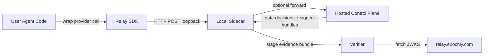

# Architecture Overview

Relay is structured as a **three-tier system**. Each tier has a single, clear
responsibility, and the boundary between tiers is enforced by code, by tests,
and by the operational topology of the public OSS repo vs. the private
hosted control plane.

1. **Relay SDK** — runs inside the user's agent process. Wraps provider calls
   (OpenAI, Anthropic, Vercel AI SDK, MCP, etc.), captures trace metadata,
   applies SDK-side redaction at the trace boundary, and submits envelopes
   to the local sidecar over loopback HTTP. The SDK never writes canonical
   outcomes; it submits **lifecycle metadata only**.
2. **Local sidecar (OSS)** — a single per-host FastAPI + SQLite daemon
   shipped in the public `relay` repository under Apache 2.0. Owns ingest,
   storage, the state engine, redaction-policy evaluation, evidence-bundle
   staging, and contract / gate evaluation for local workflows. Hosts the
   `compare_and_set_state` primitive that writes every canonical row.
3. **Hosted control plane** — the commercial Relay product (out of scope for
   this OSS repo). Adds tenant isolation, RBAC/SSO, the evidence registry,
   replay/eval workers at scale, compliance and vertical packs, and the
   trust-anchor signing service that publishes the JWKS at
   `https://relay.epochly.com/.well-known/jwks.json`.

## System diagram

The OSS local sidecar is fully functional without the hosted control plane:
local-only deployments produce signed evidence bundles, run cassette-mode
replay, and evaluate contracts. The forward arrow to the hosted plane is
opt-in and required only for organizations that need centralized tenancy,
audited registries, or compliance packs.

## What runs where

| Responsibility | Tier | OSS or hosted |
|---|---|---|
| Agent business logic, provider calls | User agent code | User-owned |
| Trace capture, adapter shims, SDK-side redaction at the trace boundary | Relay SDK | OSS (`packages/sdk-python/`, `packages/sdk-typescript/`) |
| Ingest, schema validation, state engine, SQLite WAL storage, event log, evidence staging | Local sidecar | OSS (`apps/local-sidecar/`) |
| Contract DSL parsing, CEL evaluation, gate decision writes (local) | Local sidecar | OSS (`packages/contracts/`, `packages/gate/`) |
| Cassette-mode replay proxy, per-session CA, transport-level egress denial | Local sidecar | OSS (`packages/replay-proxy/`) |
| Tenancy, RBAC/SSO, audited evidence registry, fleet-scale replay/eval workers, compliance packs | Hosted control plane | Hosted only (out of scope for OSS) |
| Trust-anchor signing service, JWKS hosting, transparency log custody | Hosted control plane | Hosted only (out of scope for OSS) |
| Offline bundle verification (default JWKS pull + BYO trust anchors) | Verifier | OSS (`packages/verifier/`); runs anywhere, including offline auditor hardware |

The verifier deserves special mention: it is shipped in OSS so that auditors
and customers can verify any bundle independently, but its **default** trust
anchor points at the hosted JWKS endpoint. Forks and self-hosters supply
their own trust anchor via the `--trust-anchor` flag — that is the supported
path.

## OSS boundary

The local sidecar provides **everything an individual developer needs to
adopt Relay end-to-end** without a Relay account:

- Single-process daemon with a four-state lockfile classifier; auto-spawned
  on first SDK call
- SQLite (WAL) storage of every canonical envelope (`run_results`,
  `gate_decisions`, `event_log_entries`, etc.)
- The `compare_and_set_state` primitive that enforces keystone invariant #1
  (control plane writes the result)
- Contract DSL evaluation with the pinned set of pure Relay UDFs
- Cassette-mode replay (default) with per-session CA and transport-level
  egress denial
- Evidence bundle staging and verification against the hosted JWKS, or
  against a BYO trust anchor

What the hosted control plane adds is a **superset for organizations**:
multi-tenant isolation, centralized policy administration, audited
evidence retention, compliance and vertical packs, and the operational
machinery (signing service, transparency log custody, key rotation under
governance) that backs the default trust anchor. None of that backing
infrastructure is required for the OSS local sidecar to function — but it
is required to issue bundles whose `trust_anchor` field points at the
hosted JWKS.

For the full OSS-vs-hosted feature matrix see
[`../cloud-upgrade/feature-parity.md`](../cloud-upgrade/feature-parity.md).

## Data flow: one agent run end-to-end

A typical agent run flows through the three tiers as follows:

1. User agent code invokes a provider call wrapped by the Relay SDK
   (e.g., `wrap_openai(...)`).
2. The SDK captures call metadata (model, latency, tokens, tool calls,
   trace span IDs), applies SDK-side redaction at the trace boundary so
   that plaintext never crosses loopback, and serializes a request
   envelope.
3. The SDK transmits the envelope to `127.0.0.1:<sidecar_port>` over
   HTTP/1.1. The port is read from `~/.relay/sidecar.lock` — never
   inferred. If the sidecar is not running, the SDK auto-spawns it via
   the four-state lockfile classifier.
4. The sidecar validates the envelope against the canonical schema in
   `packages/schemas/`, then calls `compare_and_set_state(...)`. The
   transition atomically writes one `event_log_entries` row (append-only)
   and updates `scope_state`. Submitted lifecycle metadata is recorded;
   canonical `run_results` rows are written **only by the state engine**.
5. When a CI runner or the local `rly` CLI later submits a gate-evaluation
   draft, the gate engine parses the active contract DSL, evaluates each
   assertion against the trace + evidence, and produces a draft. The
   state engine resolves the draft into a canonical `gate_decisions` row
   with `decided_by = "gate_engine"`. The draft envelope must carry the
   three-anchor handoff `(scope_id, actor_identity_hash,
   manifest_commit_hash)` or it is rejected with `RELAY-GATE-021`.
6. On `accepted` outcomes, an evidence bundle is staged via
   `object_put_with_digest` to `~/.relay/evidence/<digest>/bundle.json`.
   The bundle binds artifact hashes, the executed commands, exit codes,
   trace span IDs, assertion IDs, the manifest commit hash, and the
   `trust_anchor` field that identifies the JWKS that signed it.
7. The verifier — running locally, in CI, or on offline auditor hardware
   — fetches the JWKS identified by the bundle's `trust_anchor` (default:
   the hosted endpoint) and validates the JWS signature, the JCS-canonical
   payload, the Merkle root, the TSA timestamp, and the transparency-log
   inclusion proof.

The full set of state transitions, including the gate-restart-on-failure
rule and the three-anchor handoff contract, is documented in
[`state-machine.md`](state-machine.md). The architectural invariants that
underpin this flow are extracted in
[`keystone-invariants.md`](keystone-invariants.md).

## Cross-links

- [`keystone-invariants.md`](keystone-invariants.md) — the 16 invariants
  that define the system and are enforced in code plus guard tests.
- [`state-machine.md`](state-machine.md) — full state transition table,
  the gate-restart rule, and the three-anchor handoff structure.
- [`../cloud-upgrade/feature-parity.md`](../cloud-upgrade/feature-parity.md)
  — what the hosted control plane adds on top of the OSS local sidecar.

Spec: §A, §B
