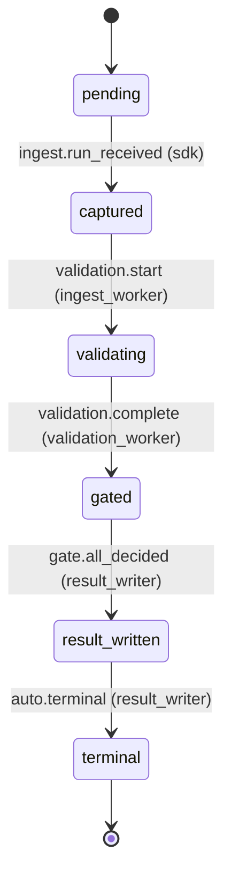

# State Machine

> Relay's control plane is a state machine. Every persistent object that
> moves through a lifecycle -- a `run`, a `replay_case`, a `gate_round`,
> an `evidence_bundle`, and the higher-level `gate` circuit-breaker
> scope -- is tracked by `scope_state` rows and advanced through
> `compare_and_set_state` (spec §C.4). This page enumerates the states,
> renders the canonical transition table from
> `packages/schemas/raw/state-transition-table.yaml`, and documents the
> two control-flow rules that distinguish Relay from generic
> orchestration: the gate-restart rule and the three-anchor handoff.

The YAML at `packages/schemas/raw/state-transition-table.yaml` is the
machine-readable extract of spec §C.3 and spec §AD. Every transition
in that file appears in the table below; the
`apps/local-sidecar/tests/test_state_transition_coverage.py` plumbing
test fails if the two diverge.

## Scope kinds and their states (§C.1, §AD)

Relay's control plane defines five scope kinds. Each scope kind has its
own state space; transitions never cross scope kinds.

| Scope kind | States | Terminal states |
| --- | --- | --- |
| `run` | `pending`, `captured`, `validating`, `gated`, `result_written`, `terminal` | `terminal` |
| `replay_case` | `proposed`, `fixtures_ready`, `executing`, `analyzed`, `terminal` | `terminal` |
| `gate_round` | `open`, `draft_received`, `evaluating`, `decision_written`, `restarted`, `terminal` | `terminal`, `restarted` |
| `evidence_bundle` | `building`, `signed`, `published`, `superseded`, `revoked` | `superseded`, `revoked` |
| `gate` | `open`, `restarted`, `stalled`, `terminal` | `terminal` |

Spec §C.1 declares the per-scope state sequences verbatim:

> ```
> Run scope (scope_kind='run')                   : pending -> captured -> validating -> gated -> result_written -> terminal
> Replay scope (scope_kind='replay_case')        : proposed -> fixtures_ready -> executing -> analyzed -> terminal
> Gate round scope (scope_kind='gate_round')     : open -> draft_received -> evaluating -> decision_written -> restarted | terminal
> Evidence bundle scope (scope_kind='evidence_bundle'): building -> signed -> published | superseded | revoked
> ```

Spec §AD line 5471 declares the higher-level `gate` scope:

> ```
> gate: open -> draft_received -> evaluating -> decision_written
>       -> restarted -> ... -> stalled | terminal
> ```

The `gate_round` scope tracks one remediation round; the `gate` scope is
the circuit-breaker scope that owns the `stalled` and `terminal`
transitions when the round cap is exceeded or an admin takes action.
Per CLAUDE.md keystone invariant #1 there is exactly one canonical
writer per scope kind: `gate_round` rows are written by the gate engine
during evaluation, and the `gate` scope's `stalled`/`terminal`
transitions are written by the gate engine or an authorised admin
(see [Three-anchor handoff](#three-anchor-handoff-c5) below).

Terminal states are sticky: once a scope enters `terminal`,
`superseded`, or `revoked`, no further transitions occur for that
scope id (spec §C.1).

## Transition table (canonical)

Every row below is rendered from
`packages/schemas/raw/state-transition-table.yaml`. The Invariants
column lists the registered guards from
`apps/local-sidecar/relay_sidecar/state_engine/guards.py` that must
return true before `compare_and_set_state` commits the new state.

| Scope | From | Event | To | Actor | Invariants (guards) |
| --- | --- | --- | --- | --- | --- |
| `run` | `pending` | `ingest.run_received` | `captured` | `sdk` | `valid_idempotency_key`, `valid_manifest_commit_hash` |
| `run` | `captured` | `validation.start` | `validating` | `ingest_worker` | `spans_batch_settled_or_client_lifecycle_terminal` |
| `run` | `validating` | `validation.complete` | `gated` | `validation_worker` | `all_required_contracts_evaluated`, `contract_results_written` |
| `run` | `gated` | `gate.all_decided` | `result_written` | `result_writer` | `all_bound_gates_decided` |
| `run` | `result_written` | `auto.terminal` | `terminal` | `result_writer` | `auto_transition_allowed` |
| `replay_case` | `proposed` | `fixtures.uploaded` | `fixtures_ready` | `replay_worker` | `fixtures_have_valid_digests` |
| `replay_case` | `fixtures_ready` | `replay.run_started` | `executing` | `replay_worker` | `sandbox_provisioned`, `network_policy_applied` |
| `replay_case` | `executing` | `replay.run_complete` | `analyzed` | `replay_worker` | `sandbox_exit_observed` |
| `replay_case` | `analyzed` | `auto.terminal` | `terminal` | `replay_worker` | `auto_transition_allowed` |
| `gate_round` | `open` | `draft.submitted` | `draft_received` | `worker` | `three_anchor_handoff_valid` |
| `gate_round` | `draft_received` | `engine.start_evaluation` | `evaluating` | `gate_engine` | `draft_not_expired` |
| `gate_round` | `evaluating` | `engine.decide` | `decision_written` | `gate_engine` | `all_conditions_evaluated` |
| `gate_round` | `decision_written` | `engine.restart_required` | `restarted` | `gate_engine` | `restart_action_applies` |
| `gate_round` | `decision_written` | `auto.terminal` | `terminal` | `gate_engine` | `terminal_action_applies` |
| `evidence_bundle` | `building` | `bundle.signed` | `signed` | `evidence_signer` | `manifest_digest_valid`, `signing_key_not_revoked` |
| `evidence_bundle` | `signed` | `bundle.published` | `published` | `evidence_signer` | `retention_policy_applied` |
| `evidence_bundle` | `published` | `retention.expire` | `superseded` | `cron` | `retention_window_elapsed_and_no_legal_hold` |
| `gate` | `restarted` | `round.cap_exceeded` | `stalled` | `gate_engine` | `round_cap_exceeded` |
| `gate` | `stalled` | `admin.reopen` | `open` | `admin` | `admin_role_org_owner_or_admin` |
| `gate` | `stalled` | `admin.terminate` | `terminal` | `admin` | `admin_role_org_owner_or_admin` |

The transition count above (20) matches the YAML row count exactly. Any
divergence between this table and the YAML is a bug -- the
`apps/local-sidecar/tests/test_state_transition_coverage.py`
parametrised plumbing test enumerates the YAML and asserts one-to-one
correspondence with the production `TRANSITION_TABLE` in
`apps/local-sidecar/relay_sidecar/state_engine/`.

## Gate-restart rule (§C)

Relay does **not** retry a failed gate in place. If a later gate (for
example, the testing gate) fails after an earlier gate (scrutiny,
structural review) passed, the engine creates a new gate round whose
predecessor is the failing round and restarts the pipeline at the
first gate. Spec § Gate restart rule (line 581) states this verbatim:

> If a later gate fails, the system must not retry only that gate. It
> must inject remediation and restart from the first gate because
> fixes from later gates can invalidate assumptions made by earlier
> gates.

Concretely, when a `gate_round` row reaches `decision_written` with
`action = remediate` (or `action = block` with `cascade_on_block =
true`), the gate engine fires `engine.restart_required` and transitions
the round to `restarted`. A new `gate_rounds` row is created with
`round_number = current + 1`, and the pipeline re-enters scrutiny --
not the gate that failed. Spec §C.3 line 3665 records the side effect
for this transition: "create new `gate_rounds` row (round+1), restart
scrutiny".

Per spec § Circuit breaker (line 587), the remediation round count is
capped (default 5 rounds for automated execution). When the cap is
exceeded, the higher-level `gate` scope transitions from `restarted`
to `stalled` -- see the next section.

## `gate.stalled` state (§AD)

The `gate.stalled` state encodes "remediation cap exceeded or admin
paused" (spec §AD line 5488). It is owned by the `gate` scope, not by
`gate_round`: a `gate_round` can transition to `restarted` indefinitely
in principle, but the parent `gate` scope only enters `stalled` when
`round.cap_exceeded` fires.

### When `gate.stalled` fires

Spec §AD line 5478 gives the trigger:

| From | Event | Guard | To | Side effect |
| --- | --- | --- | --- | --- |
| `gate.restarted` | `round.cap_exceeded` | `current_round + 1 > gate.remediation_round_cap` | `gate.stalled` | open sev2 incident; notify owner. |

The guard `round_cap_exceeded` checks `gate.remediation_round_cap`
(default 5 per § Circuit breaker line 587). When a gate has consumed
its cap of remediation rounds without producing an `accept` decision,
the gate engine transitions the parent `gate` scope to `stalled` and
emits a `gate.stalled` event in `event_log_entries`. The side effect
opens a sev2 incident and notifies the gate owner.

Spec §AD line 5488 defines the semantic precisely:

> `stalled`: cap exceeded or admin paused; only `admin.reopen` or
> `admin.terminate` move it.

### How to escape `gate.stalled`

Only an actor with role `org_owner` or `org_admin` can move a gate out
of `stalled`. Two transitions are permitted (spec §AD lines 5479-5480):

| Event | Guard | To | Side effect |
| --- | --- | --- | --- |
| `admin.reopen` | `actor.role IN ('org_owner','org_admin')` | `gate.open` (new round) | requires reason; logged in `audit_log_entries`. |
| `admin.terminate` | `actor.role IN ('org_owner','org_admin')` | `gate.terminal` | final block; sealed evidence bundle includes admin terminate claim. |

`admin.reopen` requires a written reason which is recorded in
`audit_log_entries` and resets the gate to `open` so a fresh
remediation round can begin. `admin.terminate` is the final block --
the gate moves to `terminal` and the sealed evidence bundle records the
admin's terminate claim so downstream auditors can see the decision and
its rationale.

A non-admin actor attempting `admin.reopen` or `admin.terminate` fails
the `admin_role_org_owner_or_admin` guard; the
`compare_and_set_state` call returns `GUARD_FAILED` and no transition
occurs.

## Three-anchor handoff (§C.5)

Every handoff between actors in the pipeline -- SDK to ingest, ingest
to validation, validation to gate engine, gate engine to result writer,
worker to gate engine -- carries a three-anchor tuple:

```
(scope_id, actor_identity_hash, manifest_commit_hash)
```

The receiving actor verifies all three anchors before accepting the
handoff. If any anchor fails, the handoff is rejected and the engine
emits `RELAY-GATE-021` (or the scope-equivalent error code). There is
no fallback path and no "retry without the anchor" mode.

Spec §C.5 line 3756 records the canonical error code:

> `RELAY-GATE-021` is produced when any anchor fails on a gate-draft
> submission.

### What each anchor proves

1. **`scope_id`** -- the handoff is for the run / gate / replay case it
   claims to be for. The receiver checks `payload["run_id"] == scope_id`
   (or the scope-kind-appropriate equivalent). Prevents cross-scope
   handoff replay.
2. **`actor_identity_hash`** -- the sender is registered and currently
   active. The receiver checks `actor_registry.is_active(...)`.
   Prevents handoffs from revoked or unknown actors.
3. **`manifest_commit_hash`** -- the sender is operating against an
   active manifest (or one within the grace window). The receiver
   checks `manifest_registry.is_active(project_id, manifest_commit_hash)`
   and falls back to `is_in_grace(...)` if the manifest is in the
   rotation grace window. Prevents stale-manifest handoffs.

Per spec §C.5 the pseudocode is:

```python
def verify_three_anchor_handoff(scope_kind, scope_id, payload) -> HandoffResult:
    # (1) Scope/run anchor: must match the scope ID in the URL/path.
    if payload["run_id"] != scope_id and scope_kind == "run":
        return HandoffResult(ok=False, reason="SCOPE_ID_MISMATCH")

    # (2) Actor identity anchor: actor_identity_hash must be registered.
    if not actor_registry.is_active(payload["actor_identity_hash"]):
        return HandoffResult(ok=False, reason="ACTOR_NOT_REGISTERED")

    # (3) Manifest/commit anchor: manifest_commit_hash must be current for this project,
    #     unless explicitly grandfathered for a deprecated rollout window.
    if not manifest_registry.is_active(payload["project_id"], payload["manifest_commit_hash"]):
        # Allow up to manifest.grace_window after a rotation.
        if not manifest_registry.is_in_grace(payload["project_id"], payload["manifest_commit_hash"]):
            return HandoffResult(ok=False, reason="MANIFEST_NOT_ACTIVE")

    return HandoffResult(ok=True)
```

For the contract-author view of how `manifest_commit_hash` binds to a
published contract bundle, see
[../contracts/manifest-binding.md](../contracts/manifest-binding.md).

A draft submitted with a mismatched anchor is recorded as a
`gate_decision_drafts` row with `resolution_state = 'rejected_handoff'`
(spec line 3021) and never produces a `gate_decision`. A
rejected-handoff draft does **not** consume a remediation round per
spec line 5912:

> A remediation round counts only when the worker submits a new draft.
> A draft that is rejected on three-anchor-handoff grounds (§C.5) does
> not consume a round; that's `invalid`, not `remediate`.

## Run lifecycle (mermaid)

The diagram below visualises the `run` scope. Compare with the first
five rows of the transition table above.



Every edge carries an actor in parentheses. Per CLAUDE.md keystone
invariant #1, only the labelled actor may initiate that transition;
any other actor is rejected with `ACTOR_NOT_ALLOWED` at
`compare_and_set_state` (spec §C.4 line 3709). The `result_writer`
service is the only writer of `run_results` rows -- SDKs, ingest
workers, validation workers, and gate engines never write canonical
outcomes.

## See also

- [Architecture overview](overview.md) -- system shape (SDK,
  sidecar, hosted control plane) that hosts these state machines.
- [Keystone invariants](keystone-invariants.md) -- the 16 invariants
  that the state machine and its guards enforce, including #1
  (control plane writes the result) and #4 (three-anchor handoff).
- [Manifest binding](../contracts/manifest-binding.md) -- how
  contracts bind to `manifest_commit_hash`, the third anchor in the
  three-anchor handoff.

Spec: §C, §C.5, §AD
